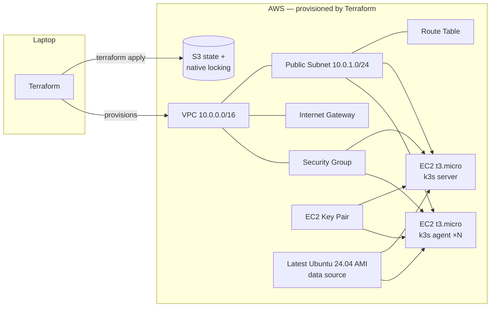
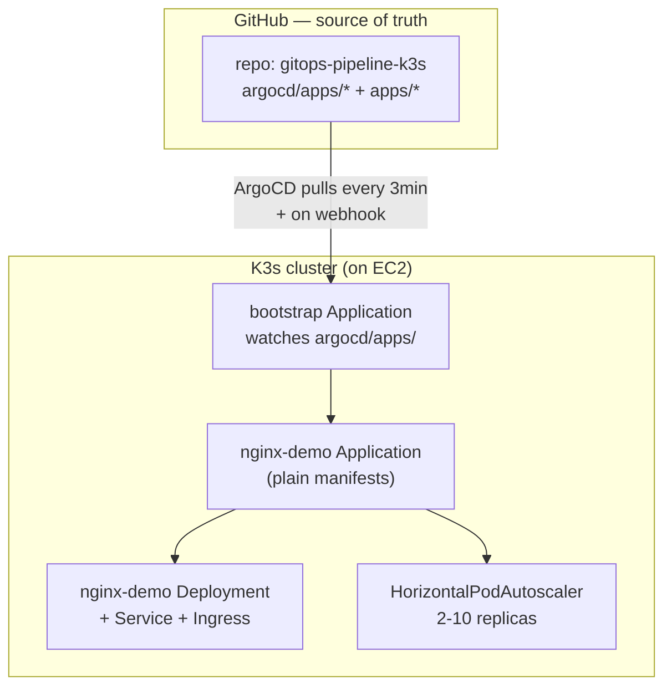
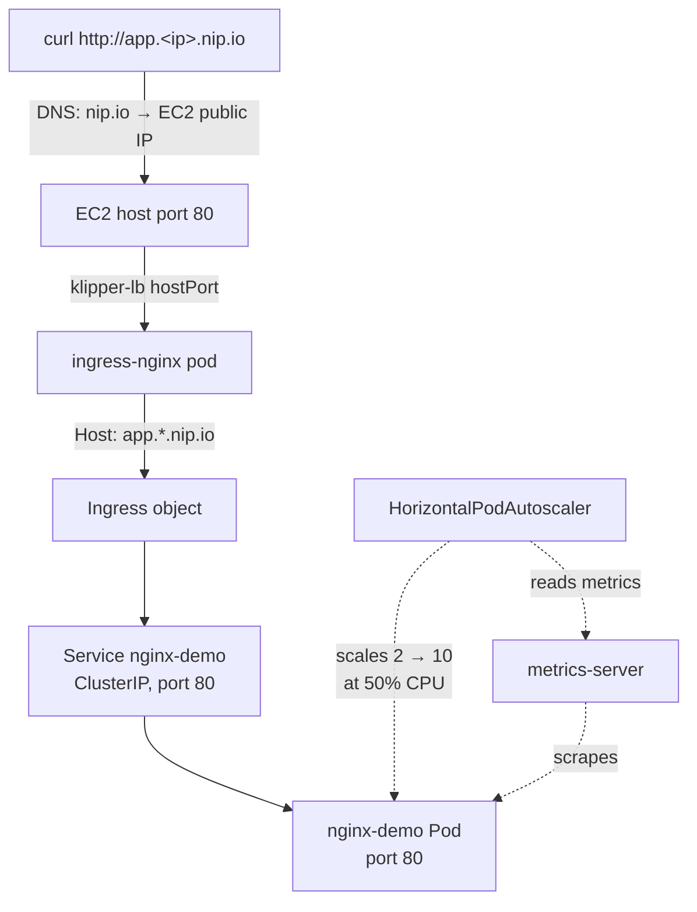

# GitOps Pipeline on Kubernetes

A multi-node K3s cluster on AWS provisioned with **Terraform**, continuously synced from this Git repo by **ArgoCD** (App-of-Apps pattern), with a **HorizontalPodAutoscaler** validated under a `hey`-driven load test.

## Stack

| Layer            | Tool                                                          |
|------------------|---------------------------------------------------------------|
| IaC              | Terraform 1.10+ (S3 state, S3 native locking via `use_lockfile`) |
| Cluster          | K3s on AWS EC2 (1 server + N agents)                          |
| Networking       | Custom VPC, public subnet, ingress-nginx LoadBalancer (klipper) |
| GitOps           | ArgoCD (App-of-Apps, auto-sync, self-heal)                    |
| Autoscaling      | HorizontalPodAutoscaler v2 (CPU-based, custom scaleUp policy) |
| Load testing     | `hey`                                                         |
| Public URLs      | `nip.io` wildcard DNS — no DNS config required                |

## Architecture (provisioning)



## Architecture (runtime / GitOps)



## Architecture (request path)



## What this project demonstrates

- **Infrastructure as Code, with state hygiene** — VPC, networking, EC2s, key pair, AMI lookup all Terraform-managed. State in S3 with native locking (the modern alternative to DynamoDB locking).
- **Reproducible cluster bootstrap** — k3s installs entirely from EC2 user-data scripts. `--disable=traefik` + ingress-nginx LoadBalancer (k3s's klipper binds host ports 80/443).
- **GitOps with App-of-Apps** — one bootstrap `Application` watches a folder of other `Application` manifests. Adding a new app = adding one YAML file. No manual `kubectl apply` after the initial bootstrap.
- **HPA with custom scaling behavior** — fast scale-up (double the pod count or +4, whichever is more), slow scale-down (5-minute stabilization window). Validated end-to-end under load.
- **Public demo URLs without DNS setup** — `nip.io` wildcard resolves any `<host>.<ip>.nip.io` to that IP — no Route 53 or domain config needed.

## Project layout

```
gitops-pipeline-k3s/
├── terraform/                # Infra
│   ├── backend.tf            # S3 state + native locking
│   ├── providers.tf
│   ├── variables.tf
│   ├── network.tf            # VPC, subnet, IGW, route table
│   ├── security.tf           # k3s security group
│   ├── compute.tf            # AMI lookup, key pair, server EC2, agent EC2 (count = N)
│   ├── outputs.tf
│   └── user-data/
│       ├── server.sh.tftpl   # k3s server install + ingress-nginx
│       └── agent.sh.tftpl    # k3s agent join
│
├── argocd/
│   ├── bootstrap.yaml        # Root Application — applied ONCE manually
│   └── apps/                 # Each YAML here is an Application managed by bootstrap
│       └── nginx-demo.yaml
│
├── apps/
│   └── nginx-demo/           # Plain K8s manifests synced by ArgoCD
│       ├── deployment.yaml
│       ├── service.yaml
│       ├── ingress.yaml
│       └── hpa.yaml          # HPA targeting nginx-demo
│
├── loadtest/
│   └── run.sh                # `hey`-based load test that triggers HPA scale-up
│
└── README.md
```

## Sizing requirements

| Tier               | Setup            | Status |
|--------------------|------------------|--------|
| Free tier          | t3.micro × 2     | Works for cluster + nginx-demo + HPA. Verified during build. |
| Production-leaning | t3.small × 2     | Comfortable headroom for adding more workloads |

The free tier is fine for what's in the repo today. If you extend this with heavier workloads later (e.g., observability stacks), bump to `t3.small` in `terraform.tfvars`.

## Running the project

### Prerequisites

- AWS account with credentials in `~/.aws/credentials` under profile `gitops` (PowerUser or AdministratorAccess)
- Terraform 1.10+
- kubectl
- `hey` for load testing (`brew install hey`)
- An S3 bucket (`gitops-pipeline-k3s-tfstate-<account-id>`) for state — create once, manually

### 1. Provision

```bash
cd terraform/
ssh-keygen -t ed25519 -f ~/.ssh/k3s-gitops -N ""

# Edit terraform.tfvars with your IP CIDR (e.g., curl ifconfig.me + /32)

terraform init
terraform apply
```

Terraform output gives you the server's public IP. Update the `host:` field in `apps/nginx-demo/ingress.yaml` to use that IP (in dashed form).

### 2. Pull kubeconfig

```bash
SERVER_IP=$(terraform -chdir=terraform output -raw server_public_ip)

ssh -i ~/.ssh/k3s-gitops ubuntu@${SERVER_IP} "sudo cat /etc/rancher/k3s/k3s.yaml" \
  | sed "s|server: https://127.0.0.1:6443|server: https://${SERVER_IP}:6443|" \
  > ~/.kube/k3s-gitops-config.yaml
chmod 600 ~/.kube/k3s-gitops-config.yaml
export KUBECONFIG=~/.kube/k3s-gitops-config.yaml

kubectl get nodes  # both Ready
```

### 3. Install ArgoCD and bootstrap

```bash
kubectl create namespace argocd
kubectl apply -n argocd --server-side \
  -f https://raw.githubusercontent.com/argoproj/argo-cd/stable/manifests/install.yaml

kubectl wait --namespace argocd --for=condition=available --timeout=300s \
  deployment/argocd-server deployment/argocd-repo-server

kubectl apply -f argocd/bootstrap.yaml
```

Within 1-2 minutes, the bootstrap Application discovers `argocd/apps/`, creates child Applications, and ArgoCD syncs them.

### 4. Verify

```bash
kubectl get applications -n argocd     # all Synced + Healthy
curl http://app.<your-ip-with-dashes>.nip.io
```

Hit the URL a few times — `Server name:` rotates between the 2 pods (load balancing across replicas).

### 5. Trigger HPA scale-up

```bash
# Terminal 1: watch HPA react
kubectl get hpa,pods -n nginx-demo -w

# Terminal 2: hammer the ingress
HOST=http://app.<your-ip-with-dashes>.nip.io ./loadtest/run.sh
```

You'll see the HPA's `desired` replicas climb past 2 within ~30 seconds, pods scaling out to 4-10 depending on load. After the test ends, the 5-minute stabilization window holds the count, then it scales back down to 2.

### 6. Teardown

```bash
cd terraform/
terraform destroy
```

Brings the AWS bill back to $0. The repo stays as the IaC artifact — re-`terraform apply` at any time to spin it back up.

## Lessons learned

**S3 backend native locking** — The `dynamodb_table` parameter on the S3 backend is deprecated as of Terraform 1.10. The replacement, `use_lockfile = true`, uses S3 conditional writes for locking — no separate DynamoDB resource needed. Modern repos should use this.

**`terraform init -reconfigure`** — Backend changes don't take effect on a regular `init`; you need `-reconfigure` (or `-migrate-state` if there's existing state to move). Caught me on the first apply when the credentials weren't being picked up by the backend.

**Server-side apply for big CRDs** — ArgoCD ships CRDs whose schemas exceed the 256KB Kubernetes annotation limit that `kubectl apply` imposes. Switching to `kubectl apply --server-side` sidesteps the limit by moving diff logic into the API server.

**Sizing matters more than you think on small clusters** — On t3.micro, the k3s API server became unresponsive (TLS handshake timeouts) under combined memory pressure. Adding 2 GiB swap with `vm.swappiness=10` stabilized it. Take-away: small clusters need swap as a release valve.

## Roadmap

- [x] Phase 1 — Terraform: backend, providers, variables
- [x] Phase 2 — Networking: VPC, subnet, IGW, route table
- [x] Phase 3 — Security group with self-referencing rule for k3s internal traffic
- [x] Phase 4 — EC2 instances + k3s install via user-data + ingress-nginx
- [x] Phase 5 — ArgoCD install + App-of-Apps bootstrap + nginx-demo
- [x] Phase 6 — HPA + load test script
